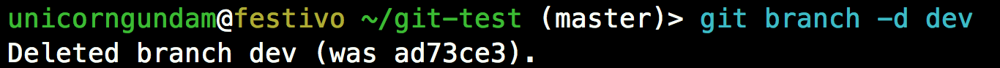

# git-test
## Setting the SSH connection to github
### 1. Generating ssh key

```sh
$ ssh-keygen -t rsa -b 4096 -C "your_email@example.com"
```

### 2. Paste the content in the `id_rsa.pub` file to github [setting](https://github.com/settings/keys) page

```sh
$ cat ~/.ssh/id_rsa.pub
```

### 3. Add the SSH key to the `ssh-agent`
First start the ssh-agent in the background.

```sh
$ eval "$(ssh-agent -s)"
```
Then add your SSH private key to the ssh-agent.

```sh
$ ssh-add ~/.ssh/id_rsa
```

### 4. Test the SSH connection

```sh
$ ssh -T git@github.com
```
If successed, it will output: `Hi <Github username> You've successfully authenticated, but GitHub does not provide shell access.`

### 5. Configure the `ssh` (optional)

If you use several **key**s, then you need to config your ssh as follow:

```sh
$ cd ~/.ssh/
$ vim config
```

Input the following content, replace the *~/.ssh/id_rsa* with your private key file for your github account.

```
Host github.com
    IdentityFile ~/.ssh/id_rsa
```

## Configuring GitHub (optional)
Setting up the configuration details of git
Note that the username here is **NOT** the GitHub user name

```
$ git init # First create an empty Git repository on local
$ git config --local user.name "<user_name>"
$ git config --local user.email "<email_id>"
```

or for **global**

```
$ git config --global user.name "<user_name>"
$ git config --global user.email "<email_id>"
```

## Commit and push to a repository on github via command lines

```
$ git add README.md
$ git commit -m "first commit"
$ git remote add origin <ssh_target>
$ git push -u origin master
```
<!-- Each time before `push`  -->

## Reference
[Connecting to GitHub with SSH](https://help.github.com/en/github/authenticating-to-github/connecting-to-github-with-ssh)

## Cheatsheet (For important commands)
### 1. Show Commit Log and Status
```sh
$ git log
```

```sh
$ git status
```


### 2. Branch Management
```sh
$ git branch -a
```

Add new local branch
```sh
## Create a new branch named `dev`
$ git branch dev
## Switch to the new branch
$ git checkout dev
```


Delete a exist branch
```sh
$ git branch -d <name>
```


### 3. Remote Repo Management
Show all the remote repos
```sh
$ git remote
```
Show the url of certain remote repo
```sh
$ git remote get-url <name>
```

Show some information of certain remote repo
```sh
$ git remote show <name>
```


